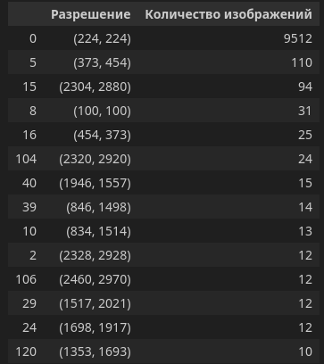
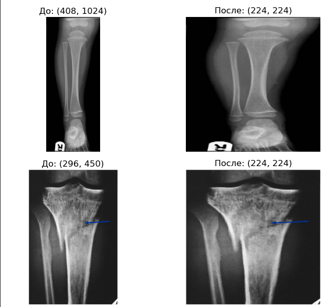
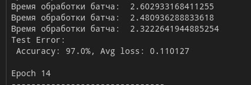
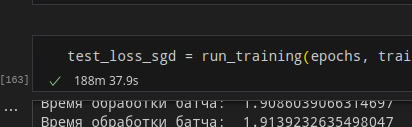

# Проектная работа 

## По дисциплине технологии машинного обучения и нейросети для решения прикладных задач

### Работу выполнил Пьянков Марк Олегович 

### Cтудент 4 курса направления "Компьютерная безопасность" Пермского Государственного национального исследовательского университета

### Тема работы: Определение переломов костей на рентгеновском снимке с помощью инструментов машинного обучения и нейросетей. 

## План работы: 

1. Изучаем датасет
2. Выбираем модели для исследования
3. Определяем функцию потерь
4. Определяем критерий качества решения задачи
5. Тренируем, исследуем
6. Делаем выводы

## Данные

#### Датасет - Bone Fracture Multi-Region X-ray Data
#### Многорегиональные ренгеновские снимки переломов костей

This dataset contains 10,580 radiographic images
- Training Data Number of Images: 9246
- Validation Data Number of Images: 828
- Test Data Number of Images: 506

Ссылка на датасет: 
https://www.kaggle.com/datasets/bmadushanirodrigo/fracture-multi-region-x-ray-data/data

- Для начала посмотрим какого разрешения у нас снимки в распоряжении:

- Видим что изображения в основном 224 на 224, но почти 10 процентов датасета являются с точки зрения типа чистым зоопарком.

Есть несколько вариантов:
- оставить только 224x224, их в любом случае достаточно много и перераспределить выборку.

- второй путь заключается в том чтобы сделать resize через либу cv, но тогда изображения будут иметь в себе неровности, шумы, выбросы и их придётся сглаживать. С одной стороны мы увеличим вариабельность выборки и генерализационных свойства модели должны улучшиться, с другой это уже данные, которые для нейросети будут выделяться на фоне остальных.

- Пример сжатия картинок:

Можно провести исследование и посмотреть результаты моделей и так и так.

На данном этапе принимаю решение, что лучше применить сжатие.

## Модели

### Модели для исследования
#### 1. SVM
#### 3. CNN ResNet 
#### 4. CNN EfficientNet в двух вариантах

- SVM взял как представителя классического машинного обучения.
- ResNet - будем использовать по классике с простым оптимизатором
- EfficientNet хочется использовать в двух вариантах и проверить возможность обучить модель быстро и качественно с минимальными ресурсами

## Функция потерь

- CrossEntropyLoss отлично подходит для классификации изображения

- В отличие от MSE, CrossEntropyLoss более чувствителен к разнице в вероятностях между правильным и неправильными классами.

- Это помогает модели быстрее сходиться.

## Критерии качества решения задачи:

- Precision Доля правильных положительных предсказаний среди всех предсказанных положительных случаев.

Причина:

Мы возьмём recall(Полнота), так как важно минимизировать количество пропущенных переломов (ложные отрицательные). Это означает, что даже если модель ошибается, предсказав "нет перелома" вместо "перелом", это более критично, чем ложные положительные, когда модель ошибочно утверждает, что перелом есть. Важно обеспечить, чтобы как можно больше реальных переломов было правильно обнаружено.

Если по-простому: 

правильно правильно - очень важно
правильно неправильно - не очень важно
Если программа сказала что у нас перелом, а по факту его нет - не очень важно
Если программа сказала что у нас нет перелома, а по факту он есть - очень важно

## Тренировка и исследование

- В качетсве первой модели вомьзём ResNet18
- Используемые гиперпараметры: lr = 0.001 epochs = 15

- Оптимизатор возьмём простой, классический - SGD

- Предобработка данных:
    - С предобработкой решил особо сначала не заморачиваться, посмотреть результаты моделей без особых ухищрений
    - Использовал resize и нормализацию
    - Аугментацию также решил не применять так как в данных уже есть достаточное кол-во повёрнутых картинок.

- Результаты следующие:
    - Сходимость медленная, но уверенная
    - К 4й фэпохе точность была 79.8
    - К 10й эпохе она уже подобралась к 89
    - Пиковый результат на 13й эпохе - 97
    - Итоговый на 15й эпохе - 95 %

