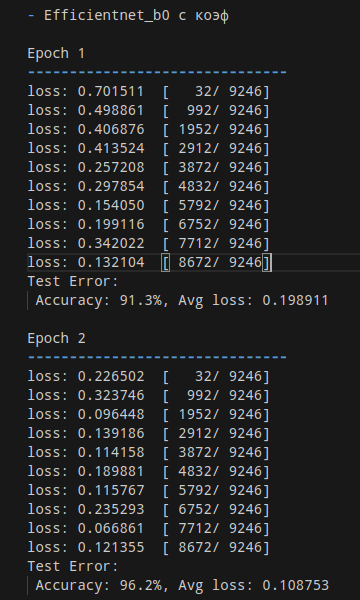

# Проектирование и разработка баз данных
---
## Выберем предметную область и создадим модель Чена

#### Предметная область : Конькобежый спорт.

#### Создадим БД для учёта проведённых соревнований, спортсменов и их результатах.

#### Для создания модели воспользуемся сайтом https://lucid.app.

#### Определяем сущности

Соревнование, спортсмен и забег(результат спортсмена)


То что у нас получилось:


---
## Создание БД

#### Давайте зайдём на сервер, создадим контейнер с PostgreSQL.

#### Подключаемся к серверу


#### Создаём lxc контейнер с названием postgrelab


#### Выбираем дистрибутив, версию и архитектуру


#### Стартуем контейнер, подключаемся к терминалу и устанавливаем postgresql


#### Проверяем как прошла установка и смотрим ip, который нам выдали в пределах lxc-brigde


#### Создадим БД, пользователя для работы с БД и наделим его правами


#### Меняем сетевую конфигурацию контейнера на физ интерфейс сервера


Файл конфигурации контейнера находится по пути /var/lib/lxc/"container name"/config

Проверяем сеть на контейнере: 


Всё чотка

#### Осталось настроить БД для подкючения к ней извне
Меняем параметр listen_addresses на '*' в конфиге, находящемуся в: /etc/postgresql/15/main/postgresql.conf

#### Лучше ещё сделать вот это, чтобы наверняка


Дописываем свой хост


---
## Подключаемся к БД 

#### Подключимся к БД через BeeKeeper studio 


Проверяем:


Всё круто

#### Создадим табличку Athlete


#### Создадим табличку Competition


#### Создадим табличку CompetitionDay


#### Создадим табличку Distance


#### Создадим табличку Race


---
## Заполняем БД

Заполним БД через скриптик.
Так выглядит конфигурация подключения:


Чтобы было поинтересней возьмём реальные имена конькобежцев с сайта speedskating results.

Ссылки прилагаю: 

1) https://speedskatingresults.com/index.php?p=4&e=22764&g=1&s=63526

2) https://speedskatingresults.com/index.php?p=4&e=22764&s=63526

3) https://speedskatingresults.com/index.php?p=4&e=22466&g=1&s=63526

4) https://speedskatingresults.com/index.php?p=4&e=22466&g=1&s=63526


Имена распологаются в теге a, что мы и укажем в парсере:


```python
import requests
from bs4 import BeautifulSoup
import re

# Список URL для парсинга
urls = [
    "https://speedskatingresults.com/index.php?p=4&e=22764&g=1&s=63526",
    "https://speedskatingresults.com/index.php?p=4&e=22466&g=1&s=63526",
    "https://speedskatingresults.com/index.php?p=4&e=22764&s=63526"
]

# Регулярное выражение для удаления текста в скобках
name_pattern = re.compile(r'\(.*\)')

# Множество для хранения уникальных имен
athletes = set()

# Парсим каждый URL
for url in urls:
    response = requests.get(url)
    soup = BeautifulSoup(response.content, 'html.parser')

    for link in soup.find_all('a', href=True):
        if 'index.php?p=17' in link['href']:  # Фильтруем ссылки на спортсменов
            name = link.text.strip()
            # Убираем текст в скобках
            name = re.sub(name_pattern, '', name).strip()
            athletes.add(name)

# Записываем имена спортсменов в файл
with open("athletes.txt", "w") as file:
    file.write("Athletes:\n")
    for athlete in athletes:
        file.write(f"{athlete}\n")

print("Athletes extracted and written to 'athletes.txt'")
```

#### Далее заполним соревнования, соревновательные дни и дистанции.

```python

# Список атлетов
athletes = read_athletes('./athletes.txt')

# Информация о соревнованиях
competitions = [
    ("Весенняя капель", "ПЕТРОВИЧ", "Perm", "2024-12-11", "2024-12-12"),
    ("Чемпионат города Пермь", "ПЕТРОВИЧ", "Perm", "2025-01-09", "2025-01-10"),
    ("Первенство ПФО", "ПЕТРОВИЧ", "Perm", "2025-11-23", "2025-11-23")
]

# Заполнение таблицы "Competition"
for competition in competitions:
    competition_name, chief_judge, location, start_date, end_date = competition
    cursor.execute("""
        INSERT INTO Competition (chief_judge, competition_name, location, start_date, end_date)
        VALUES (%s, %s, %s, %s, %s)
    """, (chief_judge, competition_name, location, start_date, end_date))

# Дистанции (500м, 1000м)
distances = [500, 1000]

# Добавление дней соревнований (1-й и 2-й день)
for competition in competitions:
    competition_name, _, location, start_date, end_date = competition
    cursor.execute("""
        SELECT competition_id FROM Competition WHERE competition_name = %s AND location = %s
    """, (competition_name, location))
    competition_id = cursor.fetchone()[0]
    
    # Добавляем два дня соревнования
    for day in [start_date, end_date]:
        cursor.execute("""
            INSERT INTO CompetitionDay (competition_id, competition_date)
            VALUES (%s, %s)
        """, (competition_id, day))

# Заполнение таблицы "Distance" для каждого дня соревнования
for competition in competitions:
    competition_name, _, location, start_date, end_date = competition
    cursor.execute("""
        SELECT competition_id FROM Competition WHERE competition_name = %s AND location = %s
    """, (competition_name, location))
    competition_id = cursor.fetchone()[0]
    
    # Получаем ID дней соревнования
    cursor.execute("""
        SELECT competition_day_id FROM CompetitionDay WHERE competition_id = %s
    """, (competition_id,))
    competition_days = cursor.fetchall()
    
    # Добавляем дистанции для каждого дня соревнования
    for competition_day in competition_days:
        competition_day_id = competition_day[0]
        for distance in distances:
            cursor.execute("""
                INSERT INTO Distance (competition_day_id, distance_length)
                VALUES (%s, %s)
            """, (competition_day_id, distance))

# Заполнение таблицы "Athlete"
for athlete in athletes:
    first_name, last_name = athlete.split()
    birth_date = generate_birth_date()
    region = random.choice(['Perm', 'Kirov'])
    coach = "Яков Николаевич" if region == "Perm" else "Александр Васильевич"
    age = random.randint(15, 23)  # случайный возраст от 15 до 23 лет
    
    # Вставка атлета в таблицу (без указания id, будет автоматически назначен)
    cursor.execute("""
        INSERT INTO Athlete (first_name, last_name, middle_name, region, coach_name, age)
        VALUES (%s, %s, %s, %s, %s, %s)
    """, (first_name, last_name, '', region, coach, age))
```


#### Генерируем результаты
- можно было так то спарсить их, но не в этот раз ))


```python
# Получаем список всех атлетов
cursor.execute("""
    SELECT athlete_id, first_name, last_name FROM Athlete
""")
athletes = cursor.fetchall()

# Получаем все соревнования
cursor.execute("""
    SELECT competition_id, competition_name FROM Competition
""")
competitions = cursor.fetchall()

# Получаем все дни соревнований для каждого соревнования
competition_days = {}
for competition_id, _ in competitions:
    cursor.execute("""
        SELECT competition_day_id, competition_date FROM CompetitionDay WHERE competition_id = %s
    """, (competition_id,))
    competition_days[competition_id] = cursor.fetchall()

# Получаем все дистанции для каждого дня соревнования
distance_ids = {}
for competition_id in competition_days:
    distance_ids[competition_id] = {}
    for competition_day_id, _ in competition_days[competition_id]:
        cursor.execute("""
            SELECT distance_id FROM Distance WHERE competition_day_id = %s
        """, (competition_day_id,))
        distance_ids[competition_id][competition_day_id] = cursor.fetchall()

# Обнуляем сериал для race_id
cursor.execute("""
    SELECT pg_catalog.setval(pg_get_serial_sequence('Race', 'race_id'), 1, false)
""")
conn.commit()

# Очистка таблицы Race перед вставкой
cursor.execute("DELETE FROM Race")
conn.commit()

# Генерация забегов для каждого спортсмена
for athlete in athletes:
    athlete_id, first_name, last_name = athlete

    # Генерация забегов для каждого соревнования
    for competition_id, competition_name in competitions:
        for competition_day_id, competition_date in competition_days[competition_id]:
            for distance_tuple in distance_ids[competition_id][competition_day_id]:
                distance_id = distance_tuple[0]

                # Генерация случайного результата (формат: минут:секунды.миллисекунды)
                result = str(random.randint(0, 2)) + ":" + str(random.randint(10, 59)) + "." + str(random.randint(10, 99))

                # Вставка забега в таблицу Race
                cursor.execute("""
                    INSERT INTO Race (distance_id, athlete_id, result)
                    VALUES (%s, %s, %s)
                """, (distance_id, athlete_id, result))
```
---
## Несколько запросов к БД

