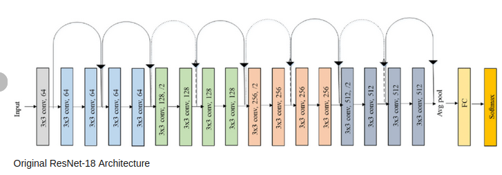

# Проектирование и разработка баз данных

## Выберем предметную область и создадим модель Чена

#### Предметная область : Конькобежый спорт.

#### Создадим БД для учёта проведённых соревнований, спортсменов и их результатах.

#### Для создания модели воспользуемся сайтом https://lucid.app.

#### Определяем сущности

Соревнование, спортсмен и забег(результат спортсмена)

То что у нас получилось:

## Создание БД

#### Давайте зайдём на сервер, создадим контейнер с PostgreSQL.

#### Подключаемся к серверу

#### Создаём lxc контейнер с названием postgrelab

#### Выбираем дистрибутив, версию и архитектуру

#### Стартуем контейнер, подключаемся к терминалу и устанавливаем postgresql

#### Проверяем как прошла установка и смотрим ip, который нам выдали в пределах lxc-brigde

#### Создадим БД, пользователя для работы с БД и наделим его правами

#### Меняем сетевую конфигурацию контейнера на физ интерфейс сервера

Файл конфигурации контейнера находится по пути /var/lib/lxc/"container name"/config

Проверяем сеть на контейнере: 

Всё чотка

#### Осталось настроить БД для подкючения к ней извне
Меняем параметр listen_addresses на '*' в конфиге, находящемуся в: /etc/postgresql/15/main/postgresql.conf

Лучше ещё сделать вот это, чтобы наверняка:

Дописываем свой хост

## Подключаемся к БД 

## Заполняем БД

Заполним БД через скриптик.
Так выглядит конфигурация подключения:

Чтобы было поинтересней возьмём реальные имена конькобежцев с сайта speedskating results. 
Ссылки прилагаю: 
1) https://speedskatingresults.com/index.php?p=4&e=22764&g=1&s=63526
2) https://speedskatingresults.com/index.php?p=4&e=22764&s=63526
3) https://speedskatingresults.com/index.php?p=4&e=22466&g=1&s=63526
4) https://speedskatingresults.com/index.php?p=4&e=22466&g=1&s=63526

Имена распологаются в теге a, что мы и укажем в парсере:

## Несколько запросов к БД

