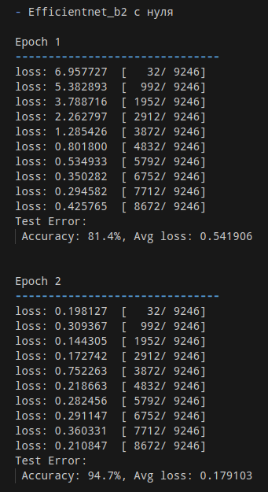

# Проектная работа 

## По дисциплине технологии машинного обучения и нейросети для решения прикладных задач

### Работу выполнил Пьянков Марк Олегович 

### Cтудент 4 курса направления "Компьютерная безопасность" Пермского Государственного национального исследовательского университета

### Тема работы: Определение переломов костей на рентгеновском снимке с помощью инструментов машинного обучения и нейросетей. 

## План работы: 

1. Изучаем датасет
2. Выбираем модели для исследования
3. Определяем функцию потерь
4. Определяем критерий качества решения задачи
5. Тренируем, исследуем
6. Делаем выводы

## Данные

#### Датасет - Bone Fracture Multi-Region X-ray Data
#### Многорегиональные ренгеновские снимки переломов костей


This dataset contains 10,580 radiographic images
- Training Data Number of Images: 9246
- Validation Data Number of Images: 828
- Test Data Number of Images: 506

Ссылка на датасет: 
https://www.kaggle.com/datasets/bmadushanirodrigo/fracture-multi-region-x-ray-data/data


- Для начала посмотрим какого разрешения у нас снимки в распоряжении:


- Видим что изображения в основном 224 на 224, но почти 10 процентов датасета являются, с точки зрения типа, чистым зоопарком.

Есть несколько вариантов:
- оставить только 224x224, их в любом случае достаточно много и перераспределить выборку.

- второй путь заключается в том чтобы сделать resize, но тогда изображения будут искажёнными. С одной стороны мы увеличим вариабельность выборки и генерализационные свойства модели должны улучшиться, с другой это уже данные, которые для нейросети будут выделяться на фоне остальных.

- Пример сжатия картинок:


Можно провести исследование и посмотреть результаты моделей и так и так.

На данном этапе принимаю решение, что лучше применить сжатие.

## Модели

### Модели для исследования
#### 1. SVM
#### 3. CNN ResNet 
#### 4. CNN EfficientNet в двух вариантах


- SVM взял как представителя классического машинного обучения.
- ResNet будем использовать по классике с простым оптимизатором
- EfficientNet хочется использовать в двух вариантах и проверить возможность обучить модель быстро и качественно с минимальными ресурсами

Пару слов о двух CNN моделях: 

##### ResNet 
**ResNet** — семейство глубоких сверточных сетей:  
- ResNet-18, ResNet-34, ResNet-50, ResNet-101, ResNet-152.  
- Хорошо масштабируется, но увеличение глубины повышает вычислительную сложность.   


##### EfficientNet  
**EfficientNet** — семейство архитектур, оптимизированных для эффективности:  
- Основана на автоматическом поиске архитектуры
- Оптимизирована для лучшего баланса **точность / производительность**.  
- Семейство моделей: EfficientNet-B0 — B7, где  
  - **B0** — базовая версия,  
  - **B7** — наиболее мощная.   


## Функция потерь

- CrossEntropyLoss отлично подходит для классификации изображения
- В отличие от MSE, CrossEntropyLoss более чувствителен к разнице в вероятностях между правильным и неправильными классами.
- Это помогает модели быстрее сходиться.


## Критерии качества решения задачи:

- Precision Доля правильных положительных предсказаний среди всех предсказанных положительных случаев.

Причина:

Мы возьмём recall(Полнота), так как важно минимизировать количество пропущенных переломов (ложные отрицательные). Это означает, что даже если модель ошибается, предсказав "нет перелома" вместо "перелом", это более критично, чем ложные положительные, когда модель ошибочно утверждает, что перелом есть. Важно обеспечить, чтобы как можно больше реальных переломов было правильно обнаружено.

Если по-простому: 

- правильно правильно - очень важно
- правильно неправильно - не очень важно
- Если программа сказала что у нас перелом, а по факту его нет - не очень важно
- Если программа сказала что у нас нет перелома, а по факту он есть - очень важно


## Тренировка и исследование

#### В качетсве первой модели вомьзём ResNet18

## Ключевые особенности  
- **Малая глубина** (18 слоев) → легкая модель.  
- **Простая архитектура**, подходит для быстрых вычислений.  

- Используемые гиперпараметры: lr = 0.001 epochs = 15

- Оптимизатор возьмём простой, классический - SGD

- Предобработка данных:
    - С предобработкой решил особо сначала не заморачиваться, посмотреть результаты моделей без особых ухищрений
    - Использовал resize и нормализацию
    - Аугментацию также решил не применять так как в данных уже есть достаточное кол-во повёрнутых картинок.

По плану было получить неудовлетворительные результаты модели и поиграться с предобработкой.

- Результаты следующие:
    - Сходимость медленная, но уверенная
    - К 4й эпохе точность была 79.8
    - К 10й эпохе она уже подобралась к 89
    - Пиковый результат на 13й эпохе - 97
    - Итоговый на 15й эпохе - 95 


#### Далее взял efficientnet_b0, с заранее обученными весами

- Гипер параметры: lr = 0.001 epochs = 3 weight_decay=1e-4

- Игрался с lr, так как у нас тут новый оптимизатор - Adam
- Он должен сходится намного быстрее нежели предыдущий


- Тут мы поменяли голову модели (последняя часть нейросети, отвечающая за классификацию)

- Использование оптимизатора только для головы модели позволяет:

    - Сэкономить вычислительные ресурсы и время, так как обновляются только параметры классификатора.


```python
# Меняем "голову" модели
num_features = model.classifier[1].in_features  
model.classifier = nn.Sequential(
    nn.Linear(num_features, 256),
    nn.ReLU(),
    nn.Dropout(0.4),
    nn.Linear(256, 1),
    nn.Sigmoid()  
)
```
В модели EfficientNet-B0 последняя часть называется classifier, и она состоит из нескольких слоев. Обычно это полносвязные слои для классификации.

model.classifier[1] — это второй слой в classifier, который является полносвязным слоем. У EfficientNet-B0 это будет слой типа Linear, и мы извлекаем количество входных признаков этого слоя через in_features. 

Это количество нейронов во входной части слоя, которое соответствует количеству признаков, передаваемых из предыдущих слоев.

Переделываем в слой к 256 нейронам, функция активации, дропаут, слой к 1 нейрону и функция активации для получения вероятности.


- Тут мы взяли Binary Cross Entropy Loss, чтобы была совместимость с изменённой головой,
- Так же немного поменяли процедуры обучения (приведение типов)

Результаты 


- Параллельно запустил на удалённой машине с бОльшими мощностями efficientnet_b2

- **EfficientNet-B0** — быстрая, лёгкая модель для быстрой обработки.  
- **EfficientNet-B2** — улучшенная точность при больших затратах вычислительных ресурсов.

lr = 0.0001  
epochs = 10
Adam

Результаты: 




#### Возьмём SVM 

- Тут пришлось поменять принцип работы с данными так как эта моделька не может работать pytorch Dataloaders

- Для того чтобы подружить эти данные с SVM воспользуемся извлечением HOG-признаков из картинок.

- HOG (Histogram of Oriented Gradients) — это метод извлечения признаков, который анализирует градиенты в изображении и строит гистограмму направлений градиентов.

- Почему мы используем HOG
    - Уменьшаем размерность данных
    - Устраняем лишнюю информацию
    - Устойчивость к освещению и шуму, так как градиенты более информативнее нежели цвета

- Параметры SVM
- kernel - linear 
- Коэфф регуляризации - 1 

Так как теперь мы загружаем все изображения с которыми мы работаем сразу в ОП, то объём выборки уменьшился, решил провести эксперимент как влиет размер выборки на точность модели: 

С увеличением размера обучающей выборки точность SVM возрастает

При 800 образцах точность 0.86.
При 2000 образцах точность достигает 0.92.
Это подтверждает, что модель лучше обучается на большем количестве данных.

Итерации оптимизации (#iter) тоже растут.

    При 800 образцах — 1995 итераций.
    При 2000 образцах — 4075 итераций.
    Это логично: больше данных = сложнее обучить модель.

SVM уступает нейросетям, но остаётся полезной для сравнения.


# Вывод

Для решения задачи мы использовали 4 модели, 3 из которых типа CNN.

На примере ResNet был показан метод решения в лоб с классическим методом оптимизации, который сходится медленно, но уверенно, что мы и увидели в процессе обучения.

С помощью efficientnet была исследована возможность быстрого "обучения"/решения задачи.
Использование самой простой модели с предобученными весами и использование b2 версии модели с нуля. 

Обе модели использовали оптимизатор Adam, но у b2 варианта скорость обучения была на порядок ниже.

Обе модели справились с поставленной задачей.
b0 всего за 3 эпохи достигла точности 97.6%
b2 обучившись с нуля за 10 эпох показала 99% -ю точность

SVM - как представитель классического машинного обучения, показала достойные результаты, но отстала по точности от CNN моделей.

Для получаения более наглядных и интересных данных можно попробовать поиграться с различными методами предобработки данных, аугментации, поиске более оптимального значения скорости обучения (lr). 

На примере данной работы было показано, что работать с нейросетями и исследовать эту область с помощью существующих библиотек крайне удобно и быстро с точки зрения написания кода, искусство этой области больше состоит в том какие параметры для моделей и для какой конерктно ситуации использовать.


